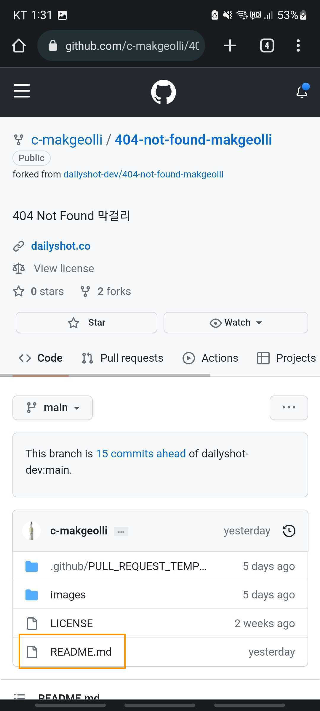
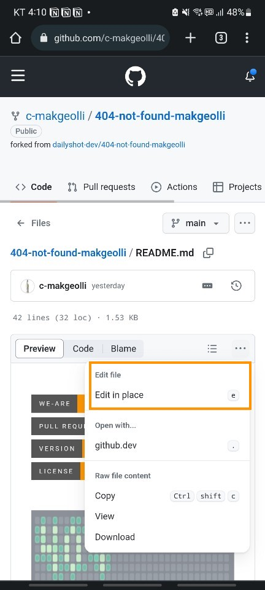
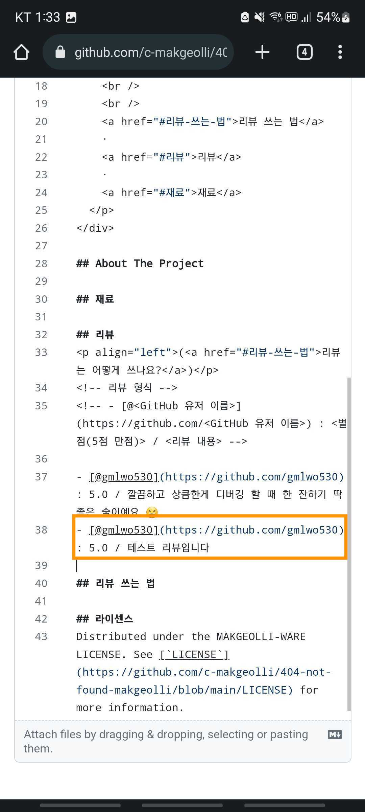
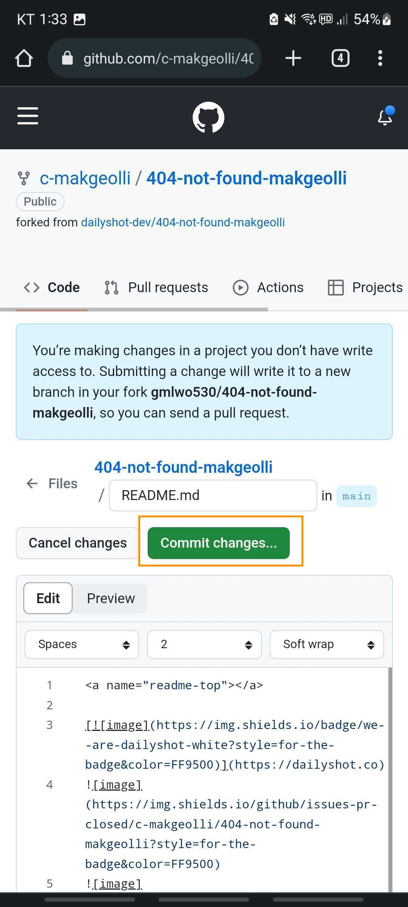
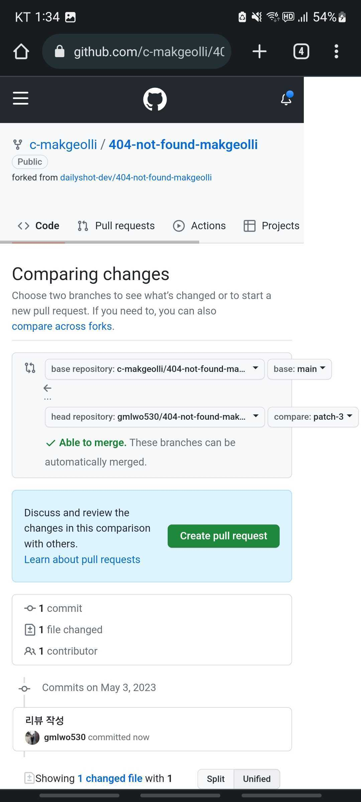

)

 

  

  <h3 align="center">404 NOT FOUND</h3>

  

    Enjoy 404 NOT FOUND!
     
     
    <a href="#리뷰-쓰는-법">리뷰 쓰는 법</a>
    ·
    <a href="#리뷰">리뷰</a>
    ·
    <a href="#재료">재료</a>
  

## 프로젝트 소개

## 리뷰

(<a href="#리뷰-쓰는-법">리뷰는 어떻게 쓰나요?</a>)

<!-- 리뷰 형식 -->
<!-- - [@<GitHub 유저 이름>](https://github.com/<GitHub 유저 이름>) : <별점(5점 만점)> / <리뷰 내용> -->

- [@gmlwo530](https://github.com/gmlwo530) : 5.0 / 깔끔하고 상큼한게 디버깅 할 때 한 잔하기 딱 좋은 술이예요 😆

## 리뷰 쓰는 법

(데스크탑에서도 가능합니다)

1. README.md 파일을 클릭합니다.

2. 오른쪽의 `•••` 버튼을 클릭 후 `Edit in place`를 클릭합니다.

3. 리뷰 섹션에 리뷰 형식에 맞게 리뷰를 작성합니다. 프로필 링크 연결은 자유입니다!

4. 리뷰 작성 후 commit change 버튼을 클릭 합니다. 커밋 메세지 형식은 자유입니다!

5. 마지막으로 `Create pull request` 해주시면 완료입니다. 머지는 빠르게 하도록 하겠습니다.

- 예시 리뷰 PR: https://github.com/c-makgeolli/404-not-found-makgeolli/pull/1

## 라이센스

Distributed under the MAKGEOLLI-WARE LICENSE. See [`LICENSE`](https://github.com/c-makgeolli/404-not-found-makgeolli/blob/main/LICENSE) for more information.
